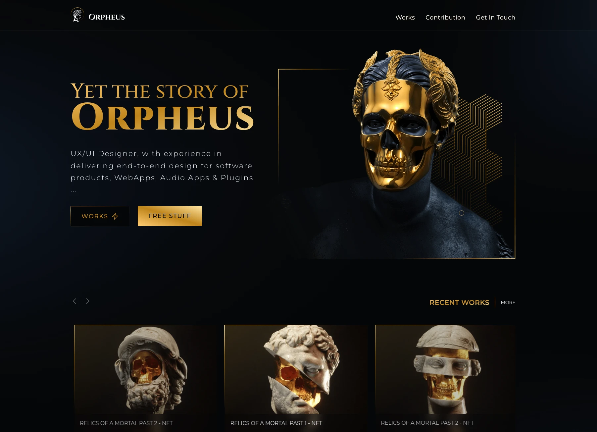

# Orpheus - Designer Portfolio



(work in progress...)
A modern designer's portfolio that brings creative concepts to life. Designed thoughtfully in Figma and built with Astro.js, featuring smooth animations and responsive design throughout the experience.

## From Design to Code
Built with care using:
- 🚀 **Astro.js** for fast performance
- ✨ **GSAP** for smooth animations
- 📱 **Tailwind CSS** for responsive design
- 🎭 **Clean aesthetics** with attention to detail

<div align="center">
  <a href="https://www.figma.com/community/file/1114495915109608886" target="_blank">
    
    Check out the Design in Figma
  </a>
</div>


## 🚀 Getting Started

1. Clone the repository:
```bash
git clone https://github.com/yourusername/orpheus-portfolio.git
```

2. Install dependencies:
```bash
pnpm install
```

3. Run the development server:
```bash
pnpm run dev
```

4. Build for production:
```bash
pnpm run build
```

## 🌐 Browser Support

- Chrome (latest)
- Firefox (latest)
- Safari (latest)
- Edge (latest)

## 📄 License

This project is licensed under the MIT License - see the LICENSE file for details.

## 🤝 Contributing

Contributions, issues, and feature requests are welcome! Feel free to check [issues page](https://github.com/orpheus-ui/orpheus-web/issues).

## 📝 TODO
### For now
- [x] Fix mobile responsiveness issues
- [ ] Optimize performance
- [ ] Create Works Page and collections
- [ ] Create Blog Page and collections
